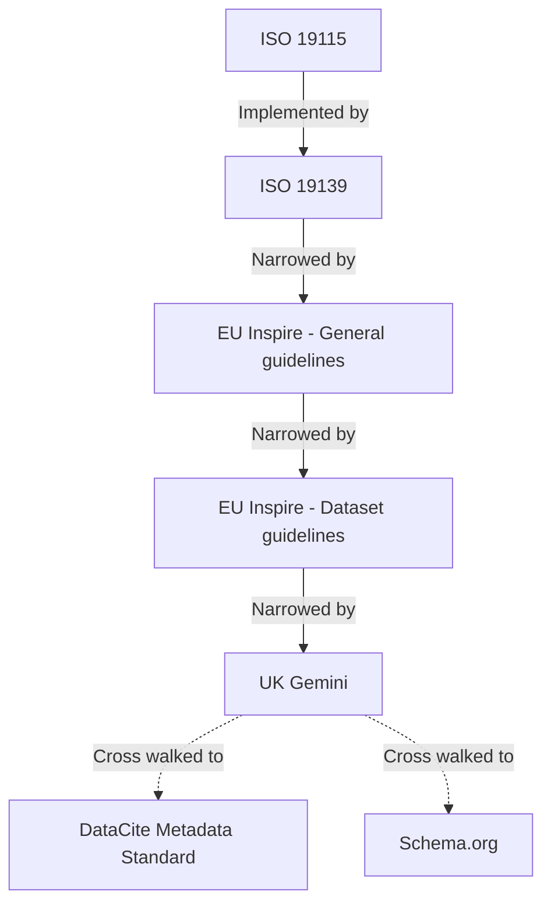

# UK Polar Data Centre (UK PDC) Metadata Records

Discovery metadata standards used in BAS and the UK PDC - 
[metadata-standards.data.bas.ac.uk](https://metadata-standards.data.bas.ac.uk)

## Aims

This project aims to document the [British Antarctic Survey's](https://www.bas.ac.uk) and the 
[UK Polar Data Centre's](https://www.bas.ac.uk/pdc) compliance with various metadata standards and profiles for 
producing discovery level metadata.

Currently this project consists of candidate records that implement all the requirements of these metadata standards 
and profiles. In addition to conformance, these candidate records improve interoperability between standards and 
implement best practices for discovery metadata. 

These candidate records are being used to guide the requirements for changes to the tools, processes and policies used 
by BAS and the UK PDC (such as editing, validating and cataloguing metadata records).

Longer term this project will act as a reference for how to implement metadata standards, containing reference records,
templates and guidance.

**Note:** Whilst this project is focused on the UK Polar Data Centre, it will have relevance to metadata producers in 
BAS and possibly NERC, and may be useful to others more generally.

## Metadata standards

A metadata *standard*, explains how to describe a resource such that it can be understood unambiguously by others. 
An *abstract standard* describes an information model. A *concrete implementation* describes how to implement an 
abstract model, such as using XML. There are relatively few standards usually made by international bodies such as ISO.

A metadata *profile*, applies on top of a metadata standard and is focused on a particular topic discipline or other
initiative. Profiles can restrict which elements in a standard may be used, make optional elements mandatory, add or 
restrict options for elements with controlled values and provide guidance on which elements and values to use in 
different situations. There are a large range of profiles from different groups such as national and international 
standards bodies, discipline or location specific groups and large collaborative projects.

Profile's cannot make mandatory elements in the standard they apply to, optional (i.e. a profile can only be 
restrictive, not permissive). 

A metadata *cross walk* is a mapping of how elements in one metadata standard relate to elements in another. Cross 
walks can be *abstract*, for interpretation by a human, or *concrete*, where tools can automatically move metadata from 
one standard to another.

The standards and profiles currently used by BAS and the UK PDC for discovery metadata are:

| Standard/Profile                                               | Type                 | Based On  | Version (Year) | Format | Description                                                            | Required            |
| -------------------------------------------------------------- | -------------------- | --------- | -------------- | ------ | ---------------------------------------------------------------------- | ------------------- |
| [ISO 19115](https://www.iso.org/standard/26020.html)           | Standard (abstract)  | *None*    | 1.0 (2003)     | *N/A*  | Defines a conceptual model of a standard                               | Yes (by Inspire)    |
| [ISO 19139](https://www.iso.org/standard/32557.html)           | Standard (concrete)  | ISO 19115 | 1.0 (2007)     | XML    | Implements the conceptual model of ISO 19115 using XML                 | Yes (by Inspire)    |
| [EU Inspire](https://inspire.ec.europa.eu/about-inspire/563)   | Profile              | ISO 19139 | 1.3            | XML    | Common standard for a common spatial data infrastructure across Europe | Yes (by law)        |
| [UK Gemini](https://www.agi.org.uk/gemini/)                    | Profile              | ISO 19139 | 2.3            | XML    | UK implementation of the Inspire profile                               | Yes (by regulation) |
| [DataCite Metadata Standard](https://schema.datacite.org/meta) | Standard (concrete)  | *None*    | 4.2            | XML    | Cross walk of ISO 19115 to the Data Cite Metadata Standard             | No                  |
| [Schema.org](https://schema.org)                               | Standard (concrete)  | *None*    | *N/A*          | JSON   | Cross walk of ISO 19115 to Schema.org                                  | No                  |

These standards and profiles can be visualised as layers, standards at the bottom and narrowing into profiles:



### Metadata guidance

To ensure compliance, metadata standards and profiles typically provide encoding and/or implementation guidance.

Guidance used by this project:

* EU Inspire
    * [Inspire Technical Guidance for ISO 19115 (profile)](https://inspire.ec.europa.eu/documents/inspire-metadata-implementing-rules-technical-guidelines-based-en-iso-19115-and-en-iso-1)
    * [Inspire Technical Guidance for ISO 19139 (for datasets) (profile)](https://inspire.ec.europa.eu/id/document/tg/metadata-iso19139)
* UK Gemini
    * [UK Gemini encoding guidance](https://www.agi.org.uk/40-gemini/1048-uk-gemini-encoding-guidance)
    * [UK Gemini XML element order](https://www.agi.org.uk/gemini/40-gemini/1046-xml-element-order)
* Schema.org
    * [ESIP Schema.org for science](https://github.com/ESIPFed/science-on-schema.org)

### Metadata validation

To ensure compliance, metadata standards and profiles typically include a means to programmatically check records 
contain:

* any required elements
* any required/controlled element values
* elements in the correct order

Metadata standards typically use schemas and schematrons to determine if a record is valid:

* a *schema* checks the structure of elements in a record
* a *schematron* checks specific elements in a record using a series of rules and patterns

Notably a schematron can be use conditional logic, such as to ensure an element is included when certain conditions are
met.

Some standards or profiles provide a validation service with a user interface and/or API for validating records.

| Standard/Profile                                               | Type                 | Validation Method  | Version (Year) | Format | Description                                                            | Required            |
| -------------------------------------------------------------- | -------------------- | ------------------ | -------------- | ------ | ---------------------------------------------------------------------- | ------------------- |
| [ISO 19115](https://www.iso.org/standard/26020.html)           | Standard (abstract)  | *N/A*              | 1.0 (2003)     | *N/A*  | Defines a conceptual model of a standard                               | Yes (by Inspire)    |
| [ISO 19139](https://www.iso.org/standard/32557.html)           | Standard (concrete)  | Schema             | 1.0 (2007)     | XML    | Implements the conceptual model of ISO 19115 using XML                 | Yes (by Inspire)    |
| [EU Inspire](https://inspire.ec.europa.eu/about-inspire/563)   | Profile              | *None*             | 1.3            | XML    | Common standard for a common spatial data infrastructure across Europe | Yes (by law)        |
| [UK Gemini](https://www.agi.org.uk/gemini/)                    | Profile              | Schematron         | 2.3            | XML    | UK implementation of the Inspire profile                               | Yes (by regulation) |
| [DataCite Metadata Standard](https://schema.datacite.org/meta) | Standard (concrete)  | *None*             | 4.2            | XML    | Cross walk of ISO 19115 to the Data Cite Metadata Standard             | Yes (internally)    |

## XML stylesheets

XML stylesheets are used to aid reading metadata records.

### XML to HTML stylesheet

The 
[ISO 19115 to HTML](https://service.ncddc.noaa.gov/rdn/www/metadata-standards/metadata-xml/documents/ISOxml2html.zip) 
stylesheet, from the National Centers for Environmental Information (NCEI), presents metadata in a more readable form
than raw XML. This stylesheet is useful for reviewing the contents, rather than technical structure of an XML record.

### ISO rubric stylesheet

The [SpiralTracker report](https://www.ngdc.noaa.gov/metadata/published/xsl/isoRubricHTML.xsl) stylesheet, from the 
National Centers for Environmental Information (NCEI), assesses the quality of a metadata record against ISO 19115.

## Implementation

A [Flask](http://flask.palletsprojects.com) application is used for generating metadata records for each
[Metadata standard](#metadata-standards) and applying [XML stylesheets](#xml-stylesheets).

See the [development](#development) section for more information.

## Setup

```shell
$ git clone https://gitlab.data.bas.ac.uk/uk-pdc/metadata-infrastructure/metadata-standards.git
$ cd metadata-schemas
```

#### Local development - Docker Compose

If you have access to the [BAS GitLab instance](https://gitlab.data.bas.ac.uk), you can pull the application Docker 
image from the BAS Docker Registry. Otherwise you will need to build the Docker image locally.

```shell
# If you have access to gitlab.data.bas.ac.uk
$ docker login docker-registry.data.bas.ac.uk
$ docker-compose pull
# If you don't have access
$ docker-compose build
```

Copy `.env.example` to `.env` and edit the file to set at least any required (uncommented) options.

To run the application using the Flask development server (which reloads automatically if source files are changed):

```shell
$ docker-compose up
```

To run other commands against the Flask application (such as [Integration tests](#integration-tests)):

```shell
# in a separate terminal to `docker-compose up`
$ docker-compose run app flask [command]
# E.g.
$ docker-compose run app flask test
# List all available commands
$ docker-compose run app flask
```

## Development

Candidate records in this project are generated with a bundled Flask application. Records for each metadata standard 
are implemented using different libraries:

| Standard/Profile                                               | Type                 | Implemented With                                                       | Notes               |
| -------------------------------------------------------------- | -------------------- | ---------------------------------------------------------------------- | ------------------- |
| [ISO 19115](https://www.iso.org/standard/26020.html)           | Standard (abstract)  | *N/A*                                                                  | -                   |
| [ISO 19139](https://www.iso.org/standard/32557.html)           | Standard (concrete)  | [bas-metadata-library](https://pypi.org/project/bas-metadata-library/) | -                   |
| [EU Inspire](https://inspire.ec.europa.eu/about-inspire/563)   | Profile              | [bas-metadata-library](https://pypi.org/project/bas-metadata-library/) | -                   |
| [UK Gemini](https://www.agi.org.uk/gemini/)                    | Profile              | [bas-metadata-library](https://pypi.org/project/bas-metadata-library/) | -                   |
| [DataCite Metadata Standard](https://schema.datacite.org/meta) | Standard (concrete)  | *None*                                                                 | Not yet implemented |
| [Schema.org](https://schema.org)                               | Standard (concrete)  | *None*                                                                 | Not yet implemented |
 
### Adding a new standard

To add a new standard:

1. update the inbuilt Flask application in `app.py` with a route for generating candidate records for the new standard
2. add relevant [Integration tests](#integration-tests) with methods to test candidate records are generated correctly

### Code Style

PEP-8 style and formatting guidelines must be used for this project, with the exception of the 80 character line limit.

[Flake8](http://flake8.pycqa.org/) is used to ensure compliance, and is ran on each commit through 
[Continuous Integration](#continuous-integration).

To check compliance locally:

```shell
$ docker-compose run app flake8 . --ignore=E501
```

### Dependencies

Python dependencies should be defined using Pip through the `requirements.txt` file. The Docker image is configured to
install these dependencies into the application image for consistency across different environments. Dependencies should
be periodically reviewed and updated as new versions are released.

To add a new dependency:

```shell
$ docker-compose run app ash
$ pip install [dependency]==
# this will display a list of available versions, add the latest to `requirements.txt`
$ exit
$ docker-compose down
$ docker-compose build
```

If you have access to the BAS GitLab instance, push the rebuilt Docker image to the BAS Docker Registry:

```shell
$ docker login docker-registry.data.bas.ac.uk
$ docker-compose push
```

### Dependency vulnerability scanning

To ensure the security of this API, all dependencies are checked against 
[Snyk](https://app.snyk.io/org/antarctica/project/-/history) for vulnerabilities. 

**Warning:** Snyk relies on known vulnerabilities and can't check for issues that are not in it's database. As with all 
security tools, Snyk is an aid for spotting common mistakes, not a guarantee of secure code.

Some vulnerabilities have been ignored in this project, see `.snyk` for definitions and the 
[Dependency exceptions](#dependency-vulnerability-exceptions) section for more information.

Through [Continuous Integration](#continuous-integration), on each commit current dependencies are tested and a snapshot
uploaded to Snyk. This snapshot is then monitored for vulnerabilities.

#### Dependency vulnerability exceptions

This project contains known vulnerabilities that have been ignored for a specific reason.

* [Py-Yaml `yaml.load()` function allows Arbitrary Code Execution](https://snyk.io/vuln/SNYK-PYTHON-PYYAML-42159)
    * currently no known or planned resolution
    * indirect dependency, required through the `bandit` package
    * severity is rated *high*
    * risk judged to be *low* as we don't use the Yaml module in this application
    * ignored for 1 year for re-review

### Static security scanning

To ensure the security of this API, source code is checked against [Bandit](https://github.com/PyCQA/bandit) for issues 
such as not sanitising user inputs or using weak cryptography. 

**Warning:** Bandit is a static analysis tool and can't check for issues that are only be detectable when running the 
application. As with all security tools, Bandit is an aid for spotting common mistakes, not a guarantee of secure code.

Through [Continuous Integration](#continuous-integration), each commit is tested.

To check locally:

```shell
$ docker-compose run app bandit -r .
```

### Debugging

To debug using PyCharm:

* *Run* -> *Edit Configurations*
* *Add New Configuration* -> *Python*

In *Configuration* tab:

* Script path: `[absolute path to project]/manage.py`
* Python interpreter: *Project interpreter* (*app* service in project Docker Compose)
* Working directory: `[absolute path to project]`
* Path mappings: `[absolute path to project]=/usr/src/app`

## Testing

### Integration tests

This project uses integration tests to ensure features work as expected and to guard against regressions and 
vulnerabilities.

The Python [UnitTest](https://docs.python.org/3/library/unittest.html) library is used for running tests using Flask's 
test framework. Test cases are defined in files within `tests/` and are automatically loaded when using the 
`test` Flask CLI command.

Tests are automatically ran on each commit through [Continuous Integration](#continuous-integration).

To run tests manually:

```shell
$ docker-compose run -e FLASK_ENV=testing app flask test --test-runner text
```

To run tests using PyCharm:

* *Run* -> *Edit Configurations*
* *Add New Configuration* -> *Python Tests* -> *Unittests*

In *Configuration* tab:

* Script path: `[absolute path to project]/tests`
* Python interpreter: *Project interpreter* (*app* service in project Docker Compose)
* Working directory: `[absolute path to project]`
* Path mappings: `[absolute path to project]=/usr/src/app`

**Note:** This configuration can be also be used to debug tests (by choosing *debug* instead of *run*).

#### JUnit support

To run integration tests to produce a JUnit compatible file, test-results.xml:

```
$ docker-compose run -e FLASK_ENV=testing app flask test --test-runner junit
```

### Continuous Integration

All commits will trigger a Continuous Integration process using GitLab's CI/CD platform, configured in `.gitlab-ci.yml`.

This process will run the application [Integration tests](#integration-tests).

Pip dependencies are also [checked and monitored for vulnerabilities](#dependency-vulnerability-scanning).

## Deployment

### Continuous Deployment

A Continuous Deployment process using GitLab's CI/CD platform is configured in `.gitlab-ci.yml`. This will:

* build the frozen version of the Flask application
* publish this build to the relevant static website

This process will deploy changes to 
[metadata-standards-testing.data.bas.ac.uk](https://metadata-standards-testing.data.bas.ac.uk) for 
all commits to the *master* branch.

This process will deploy changes to [metadata-standards.data.bas.ac.uk](https://metadata-standards.data.bas.ac.uk) for
all tagged commits.

## Release procedure

### At release

1. create a `release` branch
2. close release in `CHANGELOG.md`
3. push changes, merge the `release` branch into `master` and tag with version

The project will be built and published to 
[metadata-standards.data.bas.ac.uk](https://metadata-standards.data.bas.ac.uk) automatically through 
[Continuous Deployment](#continuous-deployment).

## Feedback

The maintainer of this project is the BAS Web & Applications Team, they can be contacted at: 
[servicedesk@bas.ac.uk](mailto:servicedesk@bas.ac.uk).

## Issue tracking

This project uses issue tracking, see the 
[issue tracker](https://gitlab.data.bas.ac.uk/uk-pdc/metadata-infrastructure/metadata-standards/issues) for more 
information.

**Note**: Read & write access to this issue tracker is restricted. Contact the project maintainer to request access.

## License

© Natural Environment Research Council (NERC), 2018-2019, British Antarctic Survey.

You may use and re-use this software and associated documentation files free of charge in any format or medium, under
the terms of the Open Government Licence v3.0.

You may obtain a copy of the Open Government Licence at http://www.nationalarchives.gov.uk/doc/open-government-licence/
