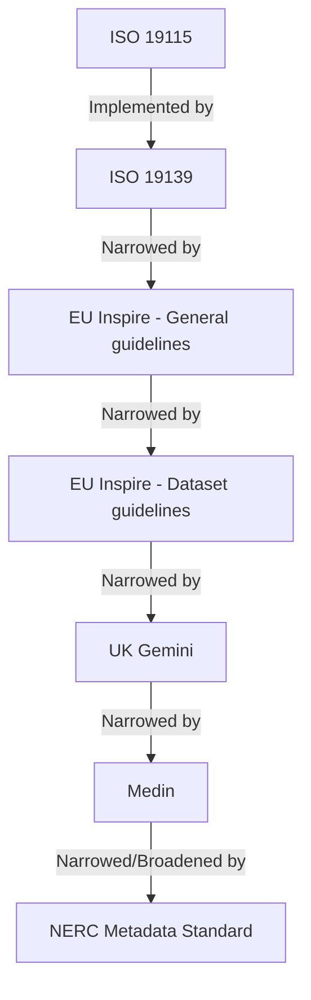
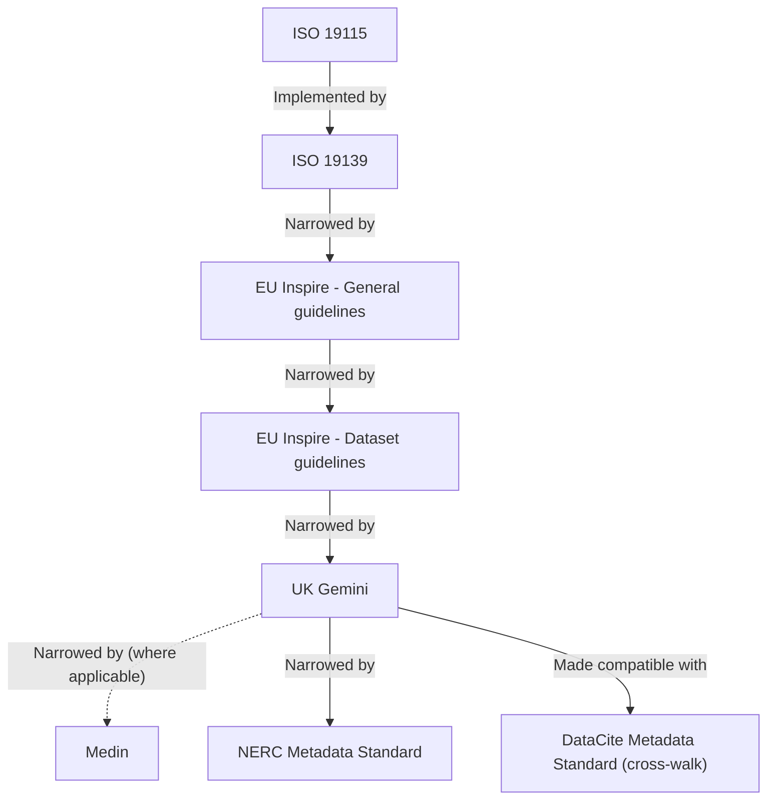

# UK Polar Data Centre (UK PDC) Metadata Records

## Aims

This project aims to document the PDC's compliance with various metadata standards related to ISO 19115 for producing
discovery level metadata. 

Initially this project is a review of current compliance and to then produce a candidate metadata record that implements 
all the requirements of these standards to pass any automatic and manual validation procedures. This review, and changes
made to the candidate record, will form the requirements for changes required to the tools, processes and policies
used by the Polar Data Centre.

In addition to conformance, this project will take the opportunity to implement best practices (such as including DOI
citations in records where relevant) and improving the consistency of information (such as the name of the UK PDC).

This project will also take into account the requirements of other metadata standards, such as the DataCite Metadata
Standard, for increased interoperability and to allow one metadata record to be used to create others through suitable 
cross-walks.

Longer term this project will act as a reference for how to implement metadata standards, containing reference records,
templates and guidance.

**Note:** Whilst this project is focused on the Polar Data Centre, it will have relevance to metadata producers in BAS
and possibly NERC, and may be useful to others more generally.

## Metadata standards

### Current standards

A metadata *standard*, in this context, explains how to describe a resource such that it can be understood unambiguously
by others. An abstract standard describes an information model. A concrete implementation describes how to represent a 
model, such as using XML. There are relatively few standards usually made by international bodies such as ISO.

A metadata *profile*, in this context, modifies a metadata standard to suit a particular focus, discipline or other
initiative. Profiles can restrict which elements in a standard may be used, make optional elements mandatory, add or 
restrict options for elements with controlled values and provide guidance on which elements and values to use in 
different situations. A profile cannot make elements that are mandatory in the standard they relate to optional (i.e.
a profile can only be restrictive, not permissive). There are a large range of profiles from different groups such as
national and international standards bodies, discipline or location specific groups and large collaborative projects.

The standards and profiles currently used by PDC for discovery metadata are:

| Name                                                          | Type                | Based On  | Version | Format | Description                                                            | Required            |
| ------------------------------------------------------------- | ------------------- | --------- | ------- | ------ | ---------------------------------------------------------------------- | ------------------- |
| [ISO 19115](https://www.iso.org/standard/26020.html)          | Standard (abstract) | *None*    | 2003    | *N/A*  | Defines a conceptual model of a standard                               | Yes (by Inspire)    |
| [ISO 19139](https://www.iso.org/standard/32557.html)          | Standard (concrete) | ISO 19115 | 2007    | XML    | Implements the conceptual model of ISO 19115 using XML                 | Yes (by Inspire)    |
| [EU Inspire](https://inspire.ec.europa.eu/about-inspire/563)  | Profile             | ISO 19139 | 1.3     | XML    | Common standard for a common spatial data infrastructure across Europe | Yes (by law)        |
| [UK Gemini](https://www.agi.org.uk/gemini/)                   | Profile             | ISO 19139 | 2.3.    | XML    | UK implementation of the Inspire profile                               | Yes (by regulation) |
| [Medin Discovery Metadata Standard](http://www.oceannet.org/) | Profile             | ISO 19139 | 2.3.8   | XML    | Community profile for UK marine data (aligned with Inspire)            | Yes (by NERC)       |
| NERC Metadata Standard                                        | Profile             | Medin     | 1       | XML    | NERC specific standard relaxing parts of the Medin profile             | Yes (by regulation) |

These standards and profiles can be visualised as layers, broadest at the bottom and narrowing in focus with each layer.



### Future standards

In the near future a cross walk will be developed to ensure requirements from the DataCite Metadata Standard can be met
by an ISO 19139 record. This standard is used in the issuance of DOIs, which are issued against discovery metadata 
records and therefore make sense to generate from the same information wherever possible.

A cross walk is a description of how elements in one standard relate to elements in another. Cross walks can be abstract
for interpretation by a human or concrete where a computer can automatically 'translate' from one standard to another.

| Name                                                                                | Type                 | Based On           | Version | Format | Description                                                                         | Required            |
| ----------------------------------------------------------------------------------- | -------------------- | ------------------ | ------- | ------ | ----------------------------------------------------------------------------------- | ------------------- |
| [ISO 19115](https://www.iso.org/standard/26020.html)                                | Standard (abstract)  | *None*             | 2003    | *N/A*  | Defines a conceptual model of a standard                                            | Yes (by Inspire)    |
| [ISO 19139](https://www.iso.org/standard/32557.html)                                | Standard (concrete)  | ISO 19115          | 2007    | XML    | Implements the conceptual model of ISO 19115 using XML                              | Yes (by Inspire)    |
| [EU Inspire](https://inspire.ec.europa.eu/about-inspire/563)                        | Profile              | ISO 19139          | 1.3     | XML    | Common standard for a common spatial data infrastructure across Europe              | Yes (by law)        |
| [UK Gemini](https://www.agi.org.uk/gemini/)                                         | Profile              | ISO 19139          | 2.3.    | XML    | UK implementation of the Inspire profile                                            | Yes (by regulation) |
| [Medin Discovery Metadata Standard](http://www.oceannet.org/)                       | Profile              | ISO 19139          | 2.3.8   | XML    | Community profile for UK marine data (aligned with Inspire)                         | Yes (by NERC)       |
| NERC Metadata Standard                                                              | Profile              | Medin (*See Note*) | 1       | XML    | NERC specific standard relaxing parts of the Medin profile                          | Yes (by regulation) |
| [DataCite Metadata Standard](https://schema.datacite.org/meta) ISO-19139 Cross-Walk | Profile (cross-walk) | ISO 19139          | *TBA*   | XML    | ISO 19139 elements that are required by DataCite Metadata Standard via a cross-walk | Yes (by ourselves)  |

**Note:** A decision is pending over whether the Medin standard will be required for all records, or just those with a
marine focus.

**Note:** A decision is pending over whether the NERC Metadata Standard should require Medin, or if Gemini would be more 
suitable.

**Note:** Until a decision is made on the role of the Medin and NERC standards this project concentrates on the Gemini
profile only. 

If Medin were to be used for marine records, and the NERC Metadata Standard is based on Gemini this could be visualised 
as:



## Candidate metadata records

A series of candidate metadata records have been created to demonstrate the changes made as part of this review. Each
record is complete and valid against one or more of the current standards.

Each record includes a series of comments which detail:

* the changes made to the record contents, including the XPath to element changed, added or removed
* discussions points for any changes that are subjective or would benefit from review by others
* general notes, such as the source each record is based off
* validation results (if applicable)
* further changes that could/should be made to a record (TODOs)

### UK PDC - discovery metadata (Gemini)

A record which is valid against:

* ISO 19115 standard
* ISO 19139 standard
* [Inspire Technical Guidance for ISO 19115 (profile)](https://inspire.ec.europa.eu/documents/inspire-metadata-implementing-rules-technical-guidelines-based-en-iso-19115-and-en-iso-1)
* [Inspire Technical Guidance for ISO 19139 (for datasets) (profile)](https://inspire.ec.europa.eu/id/document/tg/metadata-iso19139)
* [UK Gemini profile](https://www.agi.org.uk/agi-groups/standards-committee/uk-gemini)
* [UK Gemini (XML element order) (profile)](https://www.agi.org.uk/gemini/40-gemini/1046-xml-element-order)

File: [`uk-pdc-discovery-metadata-gemini.xml`](iso-19115/uk-pdc-discovery-metadata-gemini.xml).

## Template metadata records

A series of template metadata records have been created to indicate which properties in 
[Candidate records](#candidate-metadata-records) should be changed or unchanged on a per-record basis.

Templates use the `gco:nilReason="template"` attribute to indicate which elements should be changed for each record.

For example:

```xml
<gmd:dateStamp gco:nilReason="template" />
```

Should be changed to a per-record value:

```xml
<gmd:dateStamp>
    <gco:DateTime>2018-10-08T14:40:44Z</gco:DateTime>
</gmd:dateStamp>
```

Template records do not contain optional elements, except those that should be used in all records. Other optional 
elements, or additional instances of already included elements can be added where valid.

**Note:** Elements with defined values (i.e. not using `gco:nilReason="template"`) **SHOULD NOT** be changed.

## Discovery Metadata System (DMS)

The Discovery Metadata System is the in-house metadata authoring and access system used by the PDC. It consists of a
metadata editor and a metadata catalogue. The editor is internal and used by PDC staff to create new metadata records.
The [catalogue](https://data.bas.ac.uk) is external and used by anyone to view metadata records.

More information on the 
[editor](https://gitlab.data.bas.ac.uk/uk-pdc/metadata-infrastructure/discovery-metadata-system-admin) and 
[catalogue](https://gitlab.data.bas.ac.uk/uk-pdc/metadata-infrastructure/discovery-metadata-system-external) is 
available to BAS staff. In the future these will be replaced and are generally out of scope for this project.

**Note:** These applications do not store metadata in a particular standard, instead each field is stored separately in 
a database. To create metadata records, templates are used to build a record using the relevant fields needed.

An example of a metadata record in the data catalogue has been annotated with labels for each field. This is used as
to help how fields in metadata records map to fields shown in the catalogue.

It can be accessed through the [Local webserver](#local-webserver) via the [project index](`http://localhost:9000`).

## XML stylesheets

To make reading [Candidate metadata records](#candidate-metadata-records) easier, two XML stylesheets are available:

1. XML to HTML stylesheet
2. ISO rubric stylesheet

### XML to HTML stylesheet

Uses the 
[ISO 19115 to HTML](https://service.ncddc.noaa.gov/rdn/www/metadata-standards/metadata-xml/documents/ISOxml2html.zip) 
stylesheet from the National Centers for Environmental Information (NCEI) to present metadata in a more readable form
than raw XML.

This stylesheet is useful for reviewing the contents, rather than technical structure of an XML record.

It can be accessed through the [Local webserver](#local-webserver) and relies on the 
[`build--styled-record-iso-html`][#build--styled-record-iso-html] Gulp task. Once generated, styled records can be 
accessed from [project index](`http://localhost:9000`).

### ISO rubric stylesheet

Uses the [SpiralTracker report](https://www.ngdc.noaa.gov/metadata/published/xsl/isoRubricHTML.xsl) stylesheet from the 
National Centers for Environmental Information (NCEI).

This stylesheet is useful to assess the quality of a metadata record, by checking for a range of required and optional 
elements.

It can be accessed through the [Local webserver](#local-webserver) and relies on the 
[`build--styled-record-iso-rubric`][#build--styled-record-iso-rubric] Gulp task. Once generated, styled records can be 
accessed from [project index](`http://localhost:9000`).

## Validation

To ensure complaisance, metadata standards and profiles typically include the means to programmatically check metadata
records fro required elements, values and ordering.

Metadata standards typically use schemas and schematrons to determine if a record is valid. A schema checks the 
structure of a file in a systematic way and is useful for checking all elements and element values.

Metadata profiles typically use schematrons to determine if a record is valid. A schematron uses a series of rules and
patterns to check for specific elements. Notably a schematron can be use conditional logic, such as to ensure an element 
is included when certain conditions are met for example.

Some standards or profiles provide a validation service with a user interface and/or API for validating records.

Validating a record results in a pass or fail, with information usually provided on the failed rule(s). Standards and
profiles usually include guidance for the most common failures to help resolve any issues. It is up to the user whether
to fix any errors, but the record cannot be said to compliant without doing so, and may not be accepted by other 
services until they do.

| Name                                                                                | Type                 | Validation Method   | Notes                                                             |
| ----------------------------------------------------------------------------------- | -------------------- | ------------------- | ----------------------------------------------------------------- |
| [ISO 19115](https://www.iso.org/standard/26020.html)                                | Standard (abstract)  | *N/A*               | -                                                                 |
| [ISO 19139](https://www.iso.org/standard/32557.html)                                | Standard (concrete)  | Schema & Schematron | -                                                                 |
| [EU Inspire](https://inspire.ec.europa.eu/about-inspire/563)                        | Profile              | Validation Service  | Offers user interface and API                                     |
| [UK Gemini](https://www.agi.org.uk/gemini/)                                         | Profile              | Schematron          | -                                                                 |
| [Medin Discovery Metadata Standard](http://www.oceannet.org/)                       | Profile              | Schematron          | -                                                                 |
| NERC Metadata Standard                                                              | Profile              | *None* | 1          | No schematron provided, manual verification against guidance only |

The candidate records in this project have been validated against their respective standards, each record will document
the methods used for validation and each attempt.

## Gulp tasks

Certain outputs in this project need to be built from source files, the [Gulp](https://gulpjs.com/) task runner is used 
to generate these. By default Gulp is configured to watch source files and run the relevant tasks to rebuild them when
they change. If needed these tasks can be also be ran manually.

This section gives a high-level overview of the tasks Gulp runs. For detailed information and other utility tasks that
can be used, see the Gulp configuration file, [`gulpfile.js`](gulpfile.js). To run Gulp, see the 
[Local webserver](#local-webserver) section.

### `build--styled-record-iso-html`

Applies the [XML to HTML stylesheet](#xml-to-html-stylesheet) XML stylesheet to 
[Candidate metadata records](#candidate-metadata-records).

Specifically a `<?xml-stylesheet ... ?>` processing instruction is added to each source file, creating a copy in the
local webserver web root.

### `build--styled-record-iso-rubric`

Applies the [ISO rubric stylesheet](#iso-rubric-stylesheet) XML stylesheet to 
[Candidate metadata records](#candidate-metadata-records).

Specifically a `<?xml-stylesheet ... ?>` processing instruction is added to each source file, creating a copy in the
local webserver web root.

## Local webserver

A webserver is included in this project for viewing styled XML and HTML (such as page designs). The 
[Gulp](https://gulpjs.com/) task runner is ran alongside the webserver to build its contents.

These components run locally using [Docker](https://www.docker.com/) and Docker Compose. The container running Gulp is
custom and can be built locally or pulled from the BAS GitLab instance (this requires access to the BAS network).
See the [`docker-compose.yml`](docker-compose.yml) file for how these services run and the directories mounted within
each container.  

When running, the webserver can be accessed from [http://localhost:9000](http://localhost:9000). The webserver (Nginx)
is configured using [`nginx/default.conf`](nginx/default.conf), which defines `/usr/share/nginx/html/public` as the web 
root. Docker Compose will mount various directories and files into this path for viewing.

To run the local webserver:

```shell
# Get container image - If on the BAS network
$ docker login docker-registry.data.bas.ac.uk
$ docker-compose pull

# Get container image - If not on the BAS network
$ docker-compose build

# Run containers
$ docker-compose up
```

To stop the local webserver:

```shell
# press [ctrl + c] to quit the running containers first
$ docker-compose down
```

## Issue tracking

This project uses issue tracking, see the 
[issue tracker](https://gitlab.data.bas.ac.uk/uk-pdc/metadata-infrastructure/metadata-standards/issues) for more 
information.

**Note**: Read & write access to this issue tracker is restricted. Contact the project maintainer to request access.

## Feedback

The maintainer of this project is the BAS Web & Applications Team, they can be contacted at 
[servicedesk@bas.ac.uk](mailto:servicedesk@bas.ac.uk).

## License

© Natural Environment Research Council (NERC), 2018, British Antarctic Survey.

You may use and re-use this software and associated documentation files free of charge in any format or medium, under
the terms of the Open Government Licence v3.0.

You may obtain a copy of the Open Government Licence at http://www.nationalarchives.gov.uk/doc/open-government-licence/
